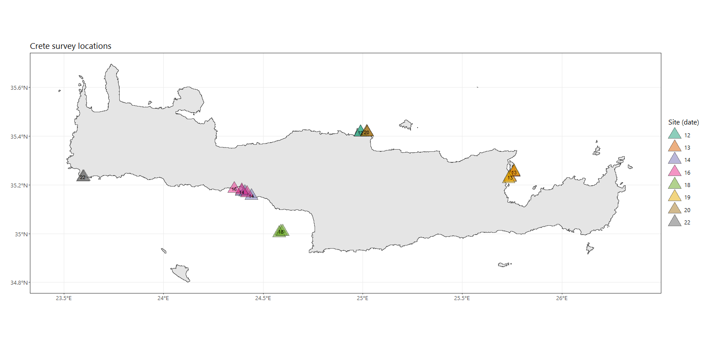
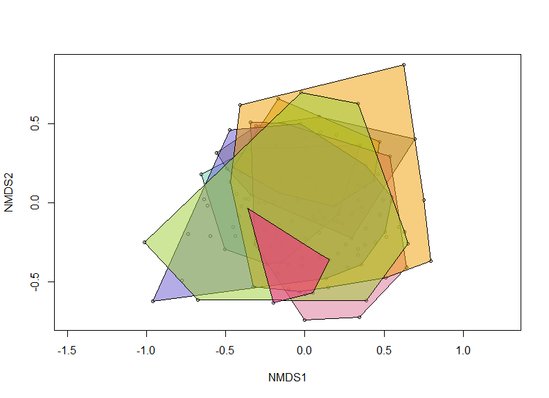
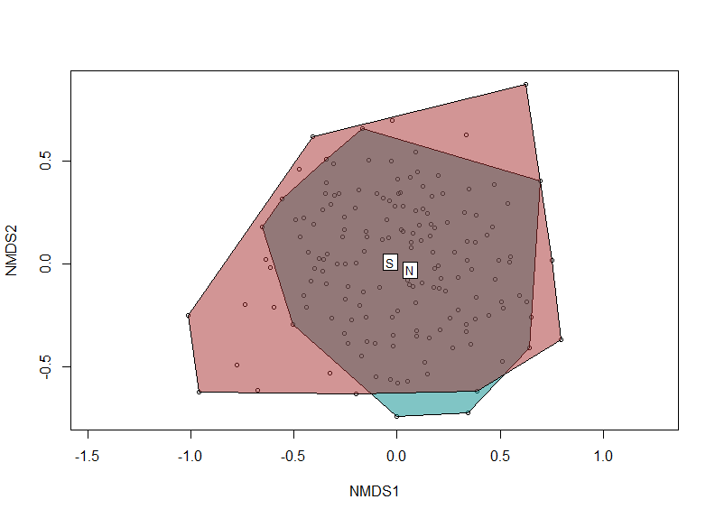
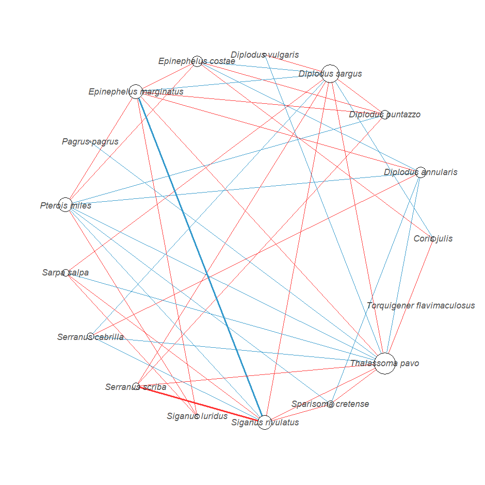

Crete_2019_Summary
========================================================
author: Belmaker Lab
date: October 2019
autosize: true

META
========================================================

***

- 14 days
- 8 diving days
- 22 sites (64 dives)
- 168 transects (~21 transects per day)
- 71 species recorded
- 10999 observations

SITES
========================================================

SITES
========================================================

NETWORKS
========================================================

