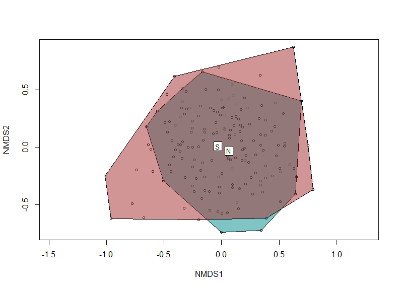

Crete 2019 summary
========================================================
autosize: true

***

Belmaker Lab

October 2019

META
========================================================

***

- 14 days (including flights)
- 8 diving days
- 22 sites (64 dives)
- 168 transects (~21 transects per day)
- 71 species recorded

SITES
========================================================

SITES
========================================================

