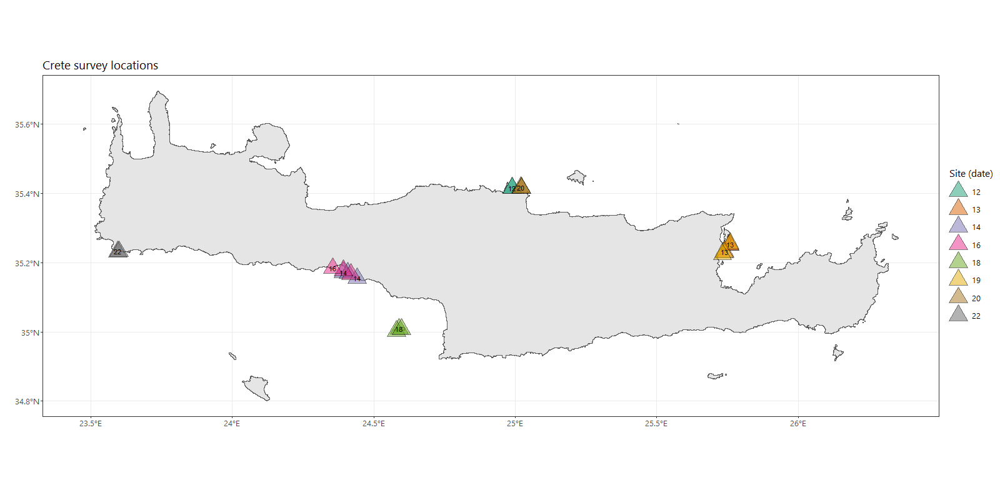
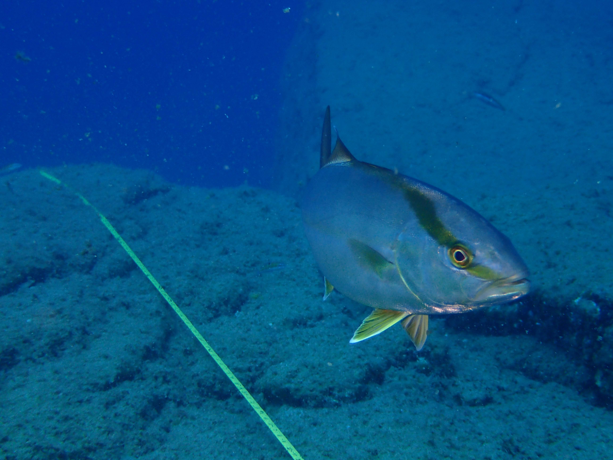

# crete2019

Underwater fish census surveys in Crete

October 2019

The repo contains:

- `R/get_crete_data.R`: Code to extract surveys data from google sheet 
- `UVC_crete_2019.csv`: Data from google sheet (after running the code)
- `CreteDives.csv`: Dive locations point data

